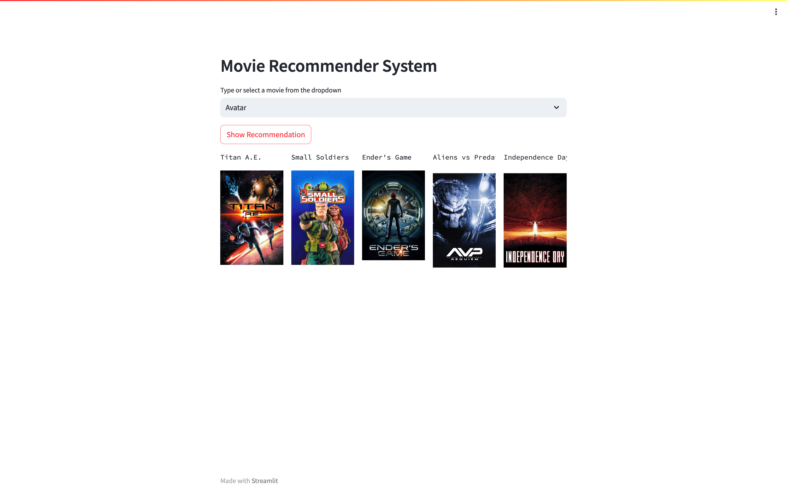

# FilmFlow: Intelligent Movie Recommender System

<!-- Table of Contents -->
<details>
<summary>Table of Contents</summary>
<ol>
    <li>
    <a href="#about-the-project">About The Project</a>
    </li>
    <li>
        <a href="#pre-requisites">Pre-requisites</a>
    </li>
    <li>
        <a href="#Getting Started">Getting Started</a>
    </li>
    <li>
        <a href="#dependencies--requirements">Dependencies / Requirements</a>
    </li>
    <li>
        <a href="#screenshots">Screenshots</a>
    </li>
</ol>
</details>

## About The Project

The Movie Recommender System project is an exploration into the realm of data science and machine learning. It focuses on creating a recommendation engine that suggests similar movies to a user-selected movie. Leveraging the TMDB (The Movie Database) dataset and utilizing the Streamlit framework for building interactive web applications, this project aims to provide users with personalized movie recommendations based on their preferences.

## Pre-requisites

Obtain the API key from [here](https://www.themoviedb.org/documentation/api) and add it in the app.py file

## Getting Started

1. Clone the repo
    ```sh
    git clone https://github.com/Genrex7/movie-recommendation-system.git
    ```

(It is recommended to use a virtual environment for this project)

2.  Install the required dependencies

    ```sh
    pip install streamlit pickle requests pandas numpy sklearn ast
    ```

3.  Obtain the dateset file from [here](https://www.kaggle.com/datasets/tmdb/tmdb-movie-metadata) and add it in the movieRecommendation.ipynb file

        ```sh
        df = pd.read_csv('tmdb_5000_movies.csv')
        ```

4.  Run the movieRecommendation.ipynb file and obtain the picker file

5.  Run the app.py file

    ```sh
    streamlit run app.py
    ```

## Dependencies / Requirements

-   [![Streamlit][streamlit]][streamlit-url]
-   [![Pandas][pandas]][pandas-url]
-   [![Numpy][numpy]][numpy-url]
-   [![Scikit-learn][scikit-learn]][scikit-learn-url]
-   [![Requests][requests]][requests-url]
-   [![Pickle][pickle]][pickle-url]

## Screenshots



[Streamlit]: https://img.shields.io/badge/Streamlit-FF4B4B?style=for-the-badge&logo=Streamlit&logoColor=white
[Streamlit-url]: https://streamlit.io/
[Pandas]: https://img.shields.io/badge/Pandas-150458?style=for-the-badge&logo=pandas&logoColor=white
[Pandas-url]: https://pandas.pydata.org/
[Numpy]: https://img.shields.io/badge/Numpy-013243?style=for-the-badge&logo=numpy&logoColor=white
[Numpy-url]: https://numpy.org/
[Scikit-learn]: https://img.shields.io/badge/Scikit--learn-F7931E?style=for-the-badge&logo=scikit-learn&logoColor=white
[Scikit-learn-url]: https://scikit-learn.org/stable/
[Requests]: https://img.shields.io/badge/Requests-FF4B4B?style=for-the-badge&logo=Requests&logoColor=white
[Requests-url]: https://requests.readthedocs.io/en/master/
[Pickle]: https://img.shields.io/badge/Pickle-FF4B4B?style=for-the-badge&logo=Pickle&logoColor=white
[Pickle-url]: https://docs.python.org/3/library/pickle.html
